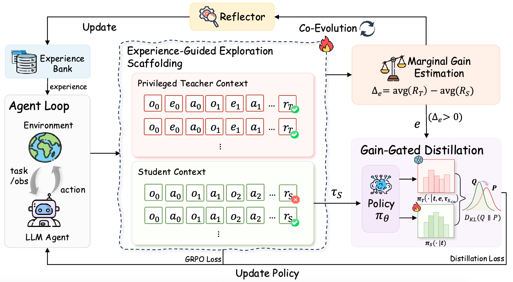

<div align="center">
<a id="readme-top"></a>
<h1>
  Experience-Distillation for Guided Exploration in Agentic Reinforcement Learning
</h1>
<h3 align="center"><strong>🎉🎉 EMNLP 2026 Main 🎉🎉</strong></h3>
<a href="https://arxiv.org/abs/2608.21946"></a>

**Experience-Distillation for Guided Exploration in Agentic Reinforcement Learning**

Can Xie, Yuyi Zhou, Wen Yang, Ziyi zhang, Siyao Song, Yingzhuo Deng, Shuo Ren, Jiajun Zhang

University of Chinese Academy Sciences & Institute of Automation

</div>

## Table of Contents

- [📖 Overview](#-overview)
- [🚀 Getting Started](#-getting-started)
- [🏃 Training](#-training)
- [📚 Citation](#-citation)
- [🙏 Acknowledgement](#-acknowledgement)

<p align="right"><a href="#readme-top"></a></p>


## 📖 Overview

EDGE improves agentic reinforcement learning by distilling rollout outcomes
into reusable experiences, retrieving relevant experiences
at rollout time, and using matched contrastive experience trajectories to guide
exploration. 

<div align="center">
  
</div>

<p align="right"><a href="#readme-top"></a></p>

---

## 🚀 Getting Started

### Installation

```bash
git clone https://github.com/xvolcano02/EDGE.git
cd EDGE

pip install -r requirements.txt
pip install vllm==0.11.0
pip install flash-attn==2.7.4.post1 --no-build-isolation --no-cache-dir
pip install -e .

pip install openai
```

### Environment Setup

**ALFWorld**
```bash
pip install alfworld
pip install gymnasium==0.29.1
pip install stable-baselines3==2.6.0

# Download PDDL & Game files and pre-trained MaskRCNN detector
alfworld-download -f
```

**WebShop**
```bash
cd agent_system/environments/env_package/webshop
./setup.sh -d all
```

**Search**
```bash
cd agent_system/environments/env_package/search/third_party
pip install -e .
pip install gym==0.26.2
```

**API Setup**

Experience evolution is optional. Enable it only after configuring an
OpenAI-compatible endpoint in your environment:

```bash
export EXPERIENCE_UPDATE_API_KEY="..."
export EXPERIENCE_UPDATE_BASE_URL="https://your-openai-compatible-endpoint/v1"
export EXPERIENCE_UPDATE_MODEL="your-model-name"
export ENABLE_EXPERIENCE_EVOLUTION=true
```

<p align="right"><a href="#readme-top"></a></p>

---

## 🏃 Training

```bash
# Configure the required variables for your environment before running a script.
# Each script validates its required inputs and does not provide personal defaults.

# ALFWorld (EDGE experience memory)
export ALFWORLD_DATA="$HOME/.cache/alfworld"
export MODEL_PATH="/path/to/Qwen2.5-1.5B-Instruct"
export TRAIN_DATA="$PWD/data/text/train.parquet"
export VAL_DATA="$PWD/data/text/test.parquet"

bash examples/grpo_trainer/run_alfworld_edge.sh

# WebShop (EDGE experience memory)
bash examples/grpo_trainer/run_webshop_edge.sh

# Search (EDGE experience memory)
bash examples/grpo_trainer/run_search_edge.sh
```


### Embedding Mode

EDGE scripts use `Qwen/Qwen3-Embedding-0.6B` for local retrieval by default. They rank both general and task-specific experiences against the task description and inject only the most relevant results. No standalone retrieval service is required.

For a dedicated embedding GPU or a shared retrieval service, use the matching experience bank and training script:

| Environment | Experience bank | Training script |
| --- | --- | --- |
| ALFWorld | `memory_data/alfworld/state_aware_experiences_v2.json` | `examples/grpo_trainer/run_alfworld_edge.sh` |
| WebShop | `memory_data/webshop/state_aware_experiences_v2.json` | `examples/grpo_trainer/run_webshop_edge.sh` |
| Search | `memory_data/search/state_aware_experiences_v2.json` | `examples/grpo_trainer/run_search_edge.sh` |

1. Start the retrieval service in a separate terminal, selecting the experience bank for the target environment:

```bash
# Replace "alfworld" with "webshop" or "search" as needed.
CONDA_ENV=/path/to/your/conda/env \
EMBEDDING_MODEL=Qwen/Qwen3-Embedding-0.6B \
EXPERIENCES_JSON="$PWD/memory_data/alfworld/state_aware_experiences_v2.json" \
PORT=8080 \
bash examples/grpo_trainer/experience_retrieval_launch.sh
```

2. Point the matching EDGE training script to the service:

```bash
# ALFWorld
EXPERIENCE_RETRIEVAL_SERVICE_URL=http://127.0.0.1:8080 \
bash examples/grpo_trainer/run_alfworld_edge.sh

# WebShop
EXPERIENCE_RETRIEVAL_SERVICE_URL=http://127.0.0.1:8080 \
bash examples/grpo_trainer/run_webshop_edge.sh

# Search
EXPERIENCE_RETRIEVAL_SERVICE_URL=http://127.0.0.1:8080 \
bash examples/grpo_trainer/run_search_edge.sh
```

Remote retrieval requires `RETRIEVAL_MODE=embedding`; the service URL may be the server root or end in `/retrieve_batch`. Use `127.0.0.1` only when the service and all Ray workers share one host. For multi-node training, use a routable address and reserve separate GPUs or a separate node for embeddings. If the service is unreachable, requests fail instead of falling back to local retrieval. Experience-bank updates are synchronized automatically through `/reload_experiences`.

<p align="right"><a href="#readme-top"></a></p>

---

## 📚 Citation

If you find EDGE useful in your research, please cite:

```bibtex
@misc{xie2026edgeexperiencedistillationguidedexploration,
      title={EDGE: Experience-Distillation for Guided Exploration in Agentic Reinforcement Learning}, 
      author={Can Xie and Yuyi Zhou and Wen Yang and Ziyi zhang and Siyao Song and Yingzhuo Deng and Shuo Ren and Jiajun Zhang},
      year={2026},
      eprint={2608.21946},
      archivePrefix={arXiv},
      primaryClass={cs.CL},
      url={https://arxiv.org/abs/2608.21946}, 
}
```

<p align="right"><a href="#readme-top"></a></p>

## 🙏 Acknowledgement
We would like to express our gratitude to the open-source community and the following projects for making this work possible: 
[verl-agent](https://github.com/langfengQ/verl-agent), [Qwen](https://github.com/QwenLM/Qwen), etc.

<p align="right"><a href="#readme-top"></a></p>
